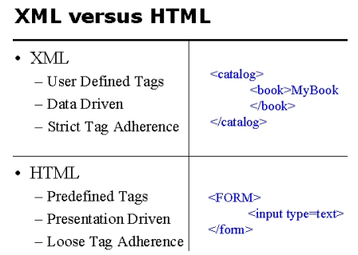

# Distributed Systems
## Remote Procedure Call Systems
Created in 1984, RPC is an extension to the request/reply messaging service. RPC consists of 2 components
- Interface Definition Language
- RPC Runtime System

### Interface Definition Language
- Operations and services must be publically available (Service Definition)
	- These define the set of procedures a client can call and the values that should be passed
- Service Definition can be used to automatically create client stub procedures for each operation (This is run on the client program)
	- Stubs deal with alll the communication and recieve the replies
	- Replies are unpacked and retured to the client program
	- Stubs are linked to the client at compile time
	- Client can make procedure calls to any stub which results in a transparent remote procedure invocation at the server
-  Server procedures are ID'd by a number in the client message
- Number is specified in the interface definition
	- From this a server dispatch routine is generated
		- Listens for incoming messages, unpacks message, calls corresponding server procedure
		- Completed procedue is returned to the dispatcher and replied to the client

### RPC Runtime System

## Web Service Design
### HTTP
#### HTTP Versions
##### HTTP 1.1
- Test based for document retrival in a human readable format. 
- Stateless protocol: Everything needed to fulfil a request must be included in the message.
- Does not require client to server to maintain state. 
##### HTTP 2
- High compatibility with 1.1
- Decrease server latency
- TCP/IP connections for faster loading 
- Fully Muliplexed: Multiple requests and responses over a single TCP connection (Prevents Head of Line blocking)
- Uses data compression of headers
- Push responses to send anticipled requests implicitly to client cache
##### HTTP 3
- QUIC Transport layer (Better than UDP)
- Lower latency, faster encryption negotiation
- Better error performance control
#### HTTP Protocol Description
##### Message Framing
Format of a message consists of:
- Initial line
- 0 or more headers
- blank line
- message body (optional)
Rich metadata can be included in hearders that is ingored by the browser making it browser friendly. Message body does not need to by hypertext allowing for different types of payloads to be sent in the message.

#### HTTP Requests
- **HTTP 1.0:**
	- GET: Get from server
	- HEAD: Return the header (GET with no content)
	- POST: Invoke server side program with data
- **HTTP 1.1:**
	- PUT: Store on server (Needs write perms)
	- OPTIONS: What options are supported by server
	- DELETE: Delete resource
	- TRACE: Echoes requests to see changes by intermediate servers
	- CONNECT: Use a proxy server to act as TCP tunnel for request

#### HTTP Response
First line of a HTTP response is a code indicating the result. Next is header data including request time and server details. MIME (Multipurpose Internet Mail Extensions) type. Mime type is contenty category/type.
- Category = Kind of media (Video, Image, Audio)
- Type = Format of media (MP4, JPG, WAV)
Content Lenght header refers to the number of bytes in the payload
##### Response Codes
- 1xx Informational
- 2xx Success
- 3xx Redirect
- 4xx Client Error
- 5xx Server Error

### Uniform Resource Identifier (URI)
Uniform Resource Identifier. Formatted string to identify a resource. There are 2 types of URI:
- URL: Uniform Resource Locator. Protocol to locate the resource identified
- URN: Uniform Resource Name. Location Independent. Does not implement any protocol to locate the resource
### XML
Designed to overcome the shortcomings of HTML. XML allows for a dynamic interface with custom type parameters. Compatible with any programming language. Allows for secure stateful transaction oriented sessions. 

### JSON
### REST
### SOAP

## Java Thread Management 