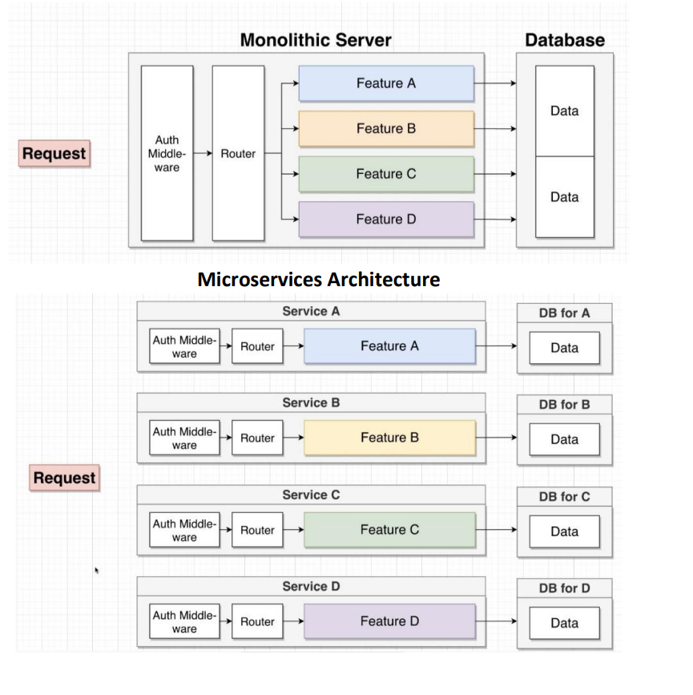
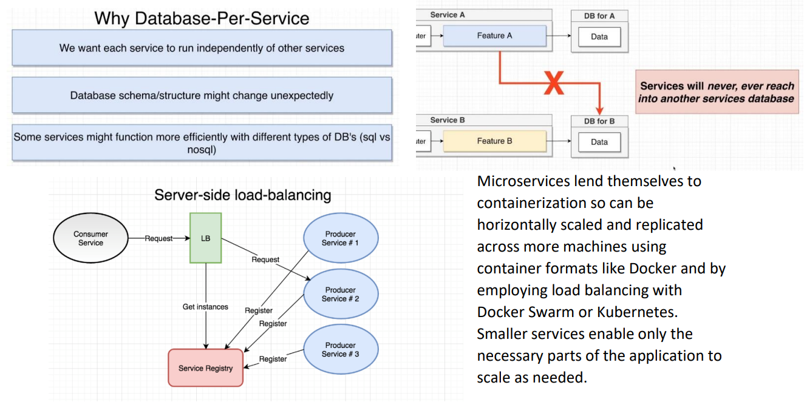

# Micro Services
JSON and XML used in REST and SOAP is all text based. The aim of microservices to to create a format more compact than JSON especially for large amounts of data transfer. 
## Microservice Architecture
Microseverices are an evolution of Service Oriented Architecture (SOA). Rather than creating services with several features, you implement each feature as a microservice. It is used to develop a single application with a set of small specific serivices operating together each with a specific function. Each microservice has the following characteristics: 
- Operate Independently of eachother
- Manage their own storage
- Communicate with clients and other microservices using lightweight protocols
- Designed to be reliable, and developed and deployed by smaller teams using their own frameworks.

## Microservice vs SOA
SOA Requires a persistent integration framework and enterprise bus for service registration and discovery.
SOA services can have featured added, however they are more comlex than a microservice.
SOA is designed around a business process. Services are part of a subsystem. Services share resources (data) with other serivices. SOA services depend on eachother therefore risk of single point of failure.
![[Pasted image 20220509134253.png]]

## Messaging between Microservices
HTTP may be used for it's broad compatibility, however it is not particularly flexible or ifficient for backend message exchange.
Microservces can run on the same application/network/machine with access to a common code base and tend to work better when not using a text based protocol like HTTP or JSON.

## Google Protocol Buffers
Due to the size and scale of google, they have created their own open source technology for communication. Google RPC (GRPC) is a protocol buffer running over HTTP 2.
Google's protocol buffer has the following characteristics:
- Language Neutral
- Platform Neutral
- Serialized extensible structured data in a binary format (new fields can be added without breaking older systems, they just ignore the new fields)
- Portable (Proto3 supports JSON conversion)

GRPC is used internallly at google for both RPC systems and persistent data storage. Code generation supports Java, Python, Objective-C, C++, Go, JavaNano, Ruby, and C#.

The ".proto" file is used to define the scheme or structure of your data. Using a platform specific protoc compiler, a statically generated API for encoding/decoding your data is created.
![[Pasted image 20220509151853.png]]

The fields of the data structure are serialized in binary chunks.
![[Pasted image 20220509152140.png]]

gRPC uses HTTP 2, the binary version of HTTP. This allows for multiplexing and multiple client requests over a single connection.

gRPC offers 4 kinds of service:
- Standard unary single request/response RPC
- Server streaming -> server returns a sequence of messages using a stream
- Client streaming -> client sends a sequence of messages using a stream
- Bidirectional streaming -> Both client and server send messages independently

RPC's can be synchronous and asynchronous (RPC can be initaited without blocking current thread. This RPC can be cancelled). The client can also specify a deadline to return an error if no response is recieved.
