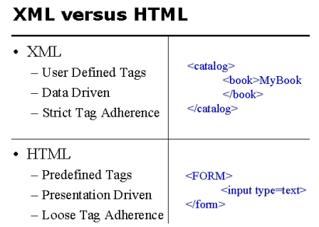
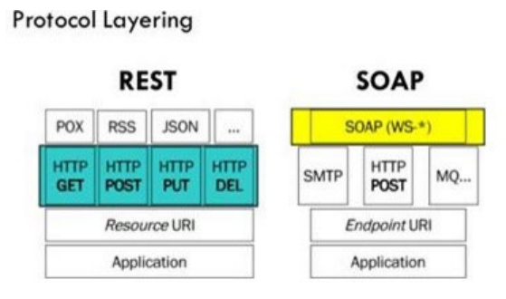
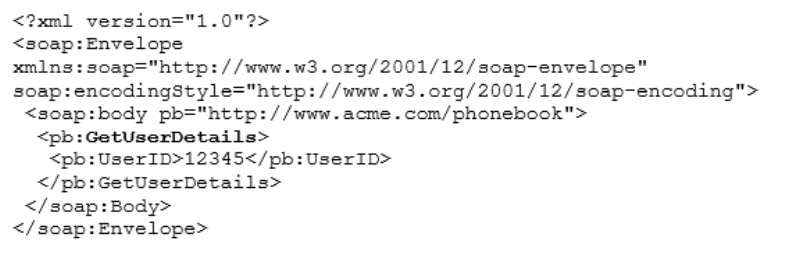

## Web Service Design
### HTTP
#### HTTP Versions
##### HTTP 1.1
- Text based for document retrival in a human readable format. 
- Stateless protocol: Everything needed to fulfil a request must be included in the message.
- Does not require client to server to maintain state. 
##### HTTP 2
- High compatibility with 1.1
- Decrease server latency
- TCP/IP connections for faster loading 
- Fully Muliplexed: Multiple requests and responses over a single TCP connection (Prevents Head of Line blocking)
- Uses data compression of headers
- Push responses to send anticipled requests implicitly to client cache
##### HTTP 3
- QUIC Transport layer (Better than UDP)
- Lower latency, faster encryption negotiation
- Better error performance control
#### HTTP Protocol Description
##### Message Framing
Format of a message consists of:
- Initial line
- 0 or more headers
- blank line
- message body (optional)
Rich metadata can be included in hearders that is ingored by the browser making it browser friendly. Message body does not need to by hypertext allowing for different types of payloads to be sent in the message.

#### HTTP Requests
- **HTTP 1.0:**
	- GET: Get from server
	- HEAD: Return the header (GET with no content)
	- POST: Invoke server side program with data
- **HTTP 1.1:**
	- PUT: Store on server (Needs write perms)
	- OPTIONS: What options are supported by server
	- DELETE: Delete resource
	- TRACE: Echoes requests to see changes by intermediate servers
	- CONNECT: Use a proxy server to act as TCP tunnel for request

GET requests are "safe requests" meaning that it has no side effects when called. PUT and DELETE are idempotent meaning identicle requests should have the same effect as a single request. In other words once you delete something you can't re delete it.

#### HTTP Response
First line of a HTTP response is a code indicating the result. Next is header data including request time and server details. MIME (Multipurpose Internet Mail Extensions) type. Mime type is contenty category/type.
- Category = Kind of media (Video, Image, Audio)
- Type = Format of media (MP4, JPG, WAV)
Content Lenght header refers to the number of bytes in the payload
##### Response Codes
- 1xx Informational
- 2xx Success
- 3xx Redirect
- 4xx Client Error
- 5xx Server Error

---

### XML
Designed to overcome the shortcomings of HTML. XML (eXtensible Markup Language) allows for a dynamic interface with custom type parameters. Compatible with any programming language. Allows for secure stateful transaction oriented sessions. HTML is simple and does not support custon MIME data types

XML was designed to store and transport data with a focus on data structure, scope and type. HTML was just used to display data with focus on rendering. Unlike HTML, XML does not use predefined tags. The author defines the tages and structure. XML based Web Services is middleware to allow applications in any language or platform to work together. Web Services have self describing interfaces that allow for:
- Interoperability
- Composability
- Extensibility
Functionality comes from applications rather than human interaction. HTTP is a standard transport protocol on a variety of platforms. XML is an interface to allow interoperability of platforms.
#### Web Services
Protocol stack based on open standards with four main components:
- Service Transport -> Transporting messages between network applications. HTTP is a popular RPC like protocol that is widely used. HTTP is firewall friendly
- XML Messaging -> Encoding messages in an XML format to be processed at either end of a network. Simple Object Access Protocol (SOAP) uses this.
- Service Description -> XML based Web Service Definition Lanuage (WSDL). Specifies operations supported and message formatting needed to use the service.
- Service Discovery -> Registry of services on a network to make their location and discription easily discoverable. This is done using the Univeral Description Discovery and Integration (UDDI) API. UDDI is XML based and platform independent. UDDI is self implemented as it's own webservice. It uses SOAP to provide access to WSDL listed in the directory.
#### Uniform Resource Identifier (URI)
Uniform Resource Identifier. Formatted string to identify a resource. There are 2 types of URI:
- URL: Uniform Resource Locator. Protocol to locate the resource identified
	```
	http://<host> [ :<port>] [<path>[?<query>]]
	```
- URN: Uniform Resource Name. Location Independent. Does not implement any protocol to locate the resource.
	- NID = Namespace Identifier
	- NSS = Namespace Specific String 
	```
	urn: <NID>:<NSS>
	```


---
### JSON
JSON is a leightweight alternative to XML. It is mostly used in REST applications. 

---
### REST vs SOAP
REpresentational State Transfer (REST) is a software architecture defined in 2000. Rest architechture contains constraints to minimise the client/server interface:
- Minimal Interface -> Keeps client and server separate allowing for easy development and scalability
- Uniform Interface -> Standardise naming conventions, data structure, and access patterns
- Stateless -> Client keeps the session state to improver server stability
- Caching -> Chache data to reduce number of requests needed
- Layered System -> Allow for intermeiary services like loadbalancers and gateways. Needed for scalability. Client does not see the layers
- Code on Demand -> Allow for the use of client side scripts (eg NodeJS)


REST Keeps it's architecture simple by using hypertext driven interfaces as well as relying on existing browser capabilities and protocol features. Modern browsers are compatible with a large variety of data types (image=jpg, video=mp4, ect.). REST puts emphasis on usining existing data types  and developing new standards for browser data types instead of creating custom types for single applications. REST Implements CRUD functionality by using the existing HTTP standards.


- Create = POST
- Read = GET
- Update = PUT
- Delete = DELETE

This gives better longevity to the API and minimises the amount of application specific features that would need to be maintained.
REST is best suited for data retrival rather than running tasks. The heavy integration of browser standards and features allows for easy retrieval and processing of media without requiring propriatary software. This allows for a simple request and text based response to be returned
REST Applications are built on 4 main abstractions:
- Resources -> Sources of information called by a URI
- Representations -> Associated metadata of a resource that can be modified by the client given perms
- Messages -> HTTP message with information to be processed correctly
- Hypermedia -> Information inside information (Kinda like hyperlinks)


An XML based web protocol. SOAP uses text based XML messaged to describe how messages should be processed and the XML Schema (Encoding Rules) for included data types. SOAP will fetch a lot of text documents. The main advantage of SOAP over REST is that the invocation method is not bound to a particular transport. While SOAP does use HTTP requests, it can substitute the transport binding. The verbosity of XML means that large text exchanges can occur which can result in unnessecary parsing and processing.

XML webservices are self describing and advertising. SOAP is well defined industry standard for enterprise computing. To overcome some of the issues with XML based services like soap, JSON is used as an alternative. This is an example of a SOAP request

The rest alternative would be a simple HTTP request to a specific address.


---